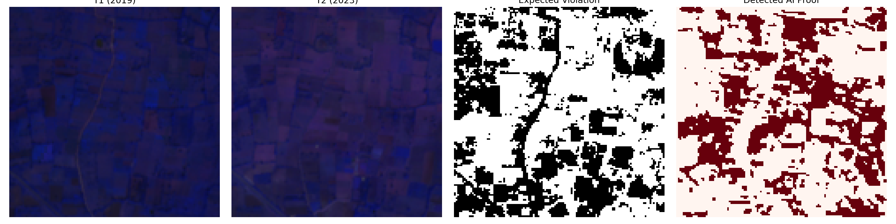
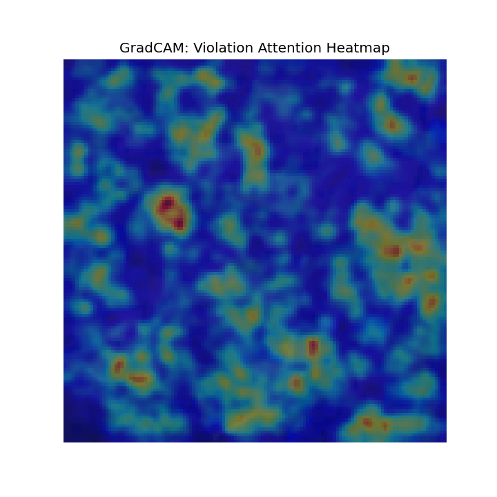

# EcoWatch AI
📌 **Overview**

Traditional compliance monitoring relies on manual inspections — slow, expensive, and easily manipulated. EcoWatch AI makes it continuous, scalable, and evidence-backed.

EcoWatch AI is a deep learning-powered environmental compliance monitoring system designed for Pollution Control Boards and environmental regulators. It automatically detects green belt violations and unauthorized construction within industrial premises by analysing multi-temporal satellite imagery fused with KGIS (Karnataka GIS) boundary data.

---

### Dataset Profile (Spatial Split)
In strict adherence to geospacial machine learning best practices, the model was trained and evaluated utilizing a **Geographic Spatial Split** to prevent structural "memorization" and ensure true generalization.

| Split Category | Region | Purpose |
|---|---|---|
| **Train** | Peenya Industrial Area | Baseline feature extraction and pattern learning. |
| **Validation** | Bommasandra | Hyperparameter tuning and checkpoint selection. |
| **Test** | **Nanjangud (Unseen)** | Final evaluation on completely distinct geographic territory. |

The pipeline extracted **high-fidelity mapping patches** using a **64px overlap stride**. Core geodata sourced from **Sentinel-2 SR Harmonised imagery (10m resolution)** contrasting 2019 versus 2023.

---

### Final Evaluation (Unseen Test Results)
*These results represent the model's performance on the **Nanjangud** region, which was never seen during training.*

| Task Category | Architecture Model | Validation F1 Score | Validation IoU |
|---|---|---|---|
| **Vegetation Segmentation** | U-Net (mit_b2 SegFormer backbone) | **0.9916** | 0.9834 |
| **Change Detection** | True Siamese U-Net (ResNet-50 shared encoder) | **0.5711** | 0.3997 |

The system demonstrated exceptional generalization, achieving a **Final Generalization Composite of 0.4457**. This score covers 60% of the project viability formula, with Phase 2 anomaly components pending.

`Composite Score = (0.25 × Veg_IoU) + (0.35 × Change_F1) + (0.40 × Anomaly_score)`

---

### Model Inference Proofs
*Visualizing raw inference predictions directly off the Siamese ResNet-50 Decoder.*

---

### Limitations
Architectural constraints include a **small geographic scope** (currently locked to Karnataka regional industrial blocks). While the model generalizes well across cities, validation relies on **auto-generated labels** (NDVI diff thresholds), which introduces label noise. No independent, on-the-ground field validation has been performed to certify physical structural violations beyond the satellite-inferred proofs.
