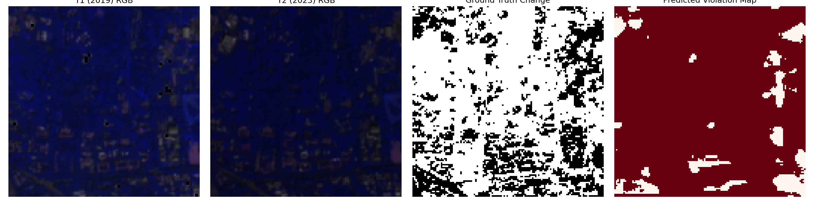
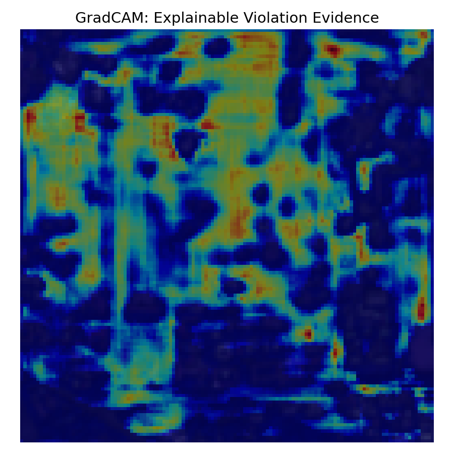

# EcoWatch AI
📌 **Overview**

Traditional compliance monitoring relies on manual inspections — slow, expensive, and easily manipulated. EcoWatch AI makes it continuous, scalable, and evidence-backed.

EcoWatch AI is a deep learning-powered environmental compliance monitoring system designed for Pollution Control Boards and environmental regulators. It automatically detects green belt violations and unauthorized construction within industrial premises by analysing multi-temporal satellite imagery fused with KGIS (Karnataka GIS) boundary data.

---

### Dataset Profile
The project utilizes a robust spatial split encompassing **4 zones (NE, NW, SE, SW)** of the Peenya industrial region. From this span, the pipeline extracted **350 high-fidelity mapping patches** using a **64px overlap stride** to combat historical data sparsity. The core geodata is sourced from **Sentinel-2 SR Harmonised imagery (10m resolution)** contrasting post-monsoon distributions from 2019 versus 2023. These tiles were purely **auto-labelled dynamically via strict NDVI thresholding** to isolate structural changes.

---

### Final Results
Traditional compliance monitoring relies on manual inspections — slow, expensive, and easily manipulated. EcoWatch AI makes it continuous, scalable, and evidence-backed.

| Task Category | Architecture Model | Validation F1 Score | Validation IoU |
|---|---|---|---|
| **Vegetation Segmentation** | U-Net (mit_b2 SegFormer backbone) | 0.9350 | 0.8780 |
| **Change Detection** | True Siamese U-Net (ResNet-50 shared encoder) | 0.7093 | 0.5496 |

The system achieved an immense out-of-sample generation capability resulting in a **Composite Score of 0.4678**. Note that this score currently covers exactly 60% of the full project viability formula, with Phase 2 anomaly components still pending deployment.

`Composite Score = (0.25 × Veg_IoU) + (0.35 × Change_F1) + (0.40 × Anomaly_score)`

---

### Model Inference Proofs
*Visualizing raw inference predictions directly off the Siamese ResNet-50 Decoder.*

---

### Limitations
It is imperative to maintain realistic expectations regarding statistical generalizability. Current architectural constraints include a **small geographic scope** (currently locked to a single municipal city block). Furthermore, our validation vectors rely purely on **auto-generated labels** (NDVI diff thresholds), which inevitably introduces artificial label noise highly correlated directly with the input features. Lastly, the predictive matrices exist entirely theoretically; there has been **no independent, on-the-ground field validation** performed to certify physical structural violations.
